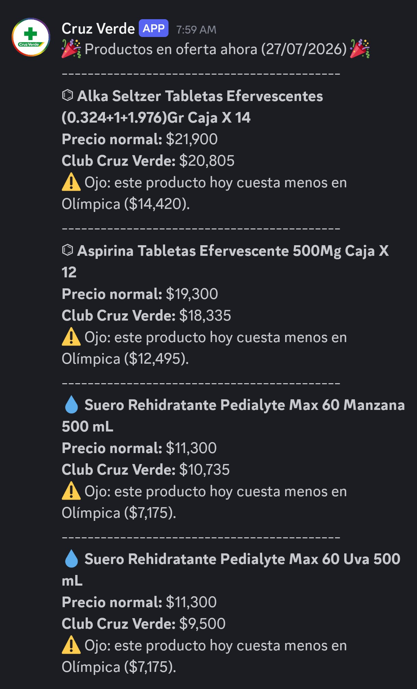

> [!TIP]
> This README file is writen in Spanish. Read this project's information in English following this link.

# Monitor de Supermercados

**Supermarket Monitor** es una aplicación desarrollada en Python que monitorea automáticamente los precios de productos en supermercados y farmacias colombianas, detecta descuentos y envía notificaciones a Discord cuando encuentra ofertas relevantes.

Actualmente integra Olímpica, Jumbo y Cruz Verde, y fue diseñada para facilitar la incorporación de nuevas cadenas en el futuro.

## Características
- Consulta automática de precios desde las APIs de cada tienda (excepto Cruz Verde, tienda para la cual se usa Playwright como método de *scraping*).
- Detección de descuentos para todos los clientes y promociones exclusivas (por ejemplo, tarjetas o clubes).
- Comparación de precios entre diferentes establecimientos para un mismo producto.
- Envío automático de notificaciones a canales de Discord.
- Arquitectura modular que facilita agregar nuevos supermercados.
- Compatible con ejecución automática mediante GitHub Actions.

## Estructura del proyecto
olimpica-monitor/

│

├── scraper/          # Clientes para las APIs de cada tienda

├── services/         # Lógica de monitoreo y comparación

├── notifiers/        # Envío de mensajes a Discord

├── data/             # Base de productos en formato JSON

├── main.py           # Punto de entrada

└── requirements.txt

## Tiendas soportadas

🛒 Olímpica

🛒 Jumbo

💊 Cruz Verde

## Funcionamiento

Cada tienda cuenta con un cliente independiente encargado de consultar su API o página web y normalizar la información obtenida.

Los monitores recorren la lista de productos definida en los archivos JSON, obtienen los precios actuales y generan una estructura común con información como nombre del producto, precio normal, precio actual y precio promocional (si existe). Actualmente, la lista de productos está hecha de manera manual porque solo me interesa monitorear unos cuantos productos, no todos los de las tiendas.

Posteriormente, se determina si el producto tiene descuento, se compara el precio con otras tiendas cuando existe un producto equivalente y se envía una notificación a Discord si corresponde.

El proyecto permite asociar productos equivalentes mediante un archivo de configuración (productos_comparables.json).

De esta forma, además de informar una oferta, el sistema puede indicar si el mismo producto se encuentra más económico en otra cadena.

### Ejemplo:

## Tecnologías utilizadas

- Python 3
- Requests
- Playwright (cuando es necesario obtener información protegida por sesión)
- Discord Webhooks
- GitHub Actions

## Automatización

El proyecto está preparado para ejecutarse de forma programada mediante GitHub Actions, permitiendo consultar precios varias veces al día sin necesidad de mantener un servidor propio.

## Objetivo

El propósito del proyecto es construir una plataforma de monitoreo de precios que facilite identificar oportunidades de ahorro y comparar ofertas entre diferentes cadenas de supermercados y farmacias colombianas, con una arquitectura escalable que permita incorporar nuevos comercios de forma sencilla.
